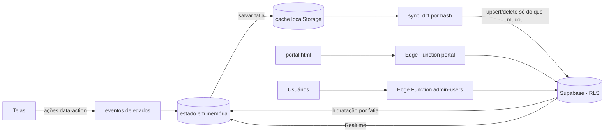

# PiscinaPro — Gestão, Vendas e Financeiro

CRM + ERP para empresas de piscinas: captação de leads, funil, propostas com PDF e **assinatura eletrônica
pelo cliente**, clientes e garantias, obras, **financeiro completo** (contas a pagar e a receber, caixa, DRE,
fluxo de caixa, comissões) e **usuários com permissões por módulo**.

- **Frontend:** HTML, CSS e JavaScript em **ES modules**, sem build e sem framework.
- **Backend:** [Supabase](https://supabase.com) — Postgres com RLS por permissão, Auth, Realtime, Storage e Edge Functions.
- **Offline-first:** a interface roda em memória, guarda cache no aparelho e sincroniza só o que mudou.
- **PWA** instalável, tema claro/escuro, acessível por teclado e responsivo no celular.
- **Hospedagem:** GitHub + Vercel (site estático).

> Banco, migrations, Edge Functions e **estado do projeto Supabase**: [BACKEND.md](BACKEND.md).
> Roteiro de teste com o servidor: [SMOKE_TEST.md](SMOKE_TEST.md).

---

## Sumário
1. [Como rodar](#como-rodar)
2. [Deploy (GitHub + Vercel)](#deploy-github--vercel)
3. [Funcionalidades](#funcionalidades)
4. [Usuários e permissões](#usuários-e-permissões)
5. [Financeiro (ERP)](#financeiro-erp)
6. [Estrutura do projeto](#estrutura-do-projeto)
7. [Arquitetura](#arquitetura)
8. [Qualidade: testes, lint e CI](#qualidade-testes-lint-e-ci)
9. [Segurança](#segurança)
10. [Pendências](#pendências)

---

## Como rodar

Requisitos: Node.js 20+ (só para o servidor local e os testes) e um navegador moderno.

```bash
npm install
```

```bash
npm run serve
```

Abra `http://localhost:5177`. O servidor local aplica os mesmos cabeçalhos de segurança (CSP) da produção.

Na tela de entrada:
- **Entrar** — login criado pelo administrador (Supabase Auth).
- **Explorar demonstração** — dados de exemplo só neste navegador; nada vai para o servidor.
- **Esqueci minha senha** — envia o link de redefinição.

Não abra o `index.html` direto pelo arquivo (`file://`): módulos ES e service worker exigem `http`.

## Deploy (GitHub + Vercel)

1. Suba o repositório para o GitHub.
2. No Vercel: **Add New → Project → Import**. Preset **Other**, sem build.
3. O [vercel.json](vercel.json) já define CSP, cabeçalhos de segurança e cache do service worker; o
   [.vercelignore](.vercelignore) publica só o app (documentação, testes, scripts e backend ficam fora do site).
4. No Supabase (banco já aplicado), ajuste o Auth conforme [BACKEND.md](BACKEND.md) (seção 1.4) — inclusive
   **desligar o cadastro aberto** e cadastrar a URL do Vercel em *Redirect URLs*.
5. No Vercel, ative **Web Analytics** e **Speed Insights** (o app já carrega os scripts em produção).

Cada push na `main` publica em produção; branches e PRs geram previews. O GitHub Actions roda lint, testes
unitários, testes de ponta a ponta e a verificação de integridade das bibliotecas em `vendor/`.

---

## Funcionalidades

### Visão Geral
Filtro de período (hoje, 7/30 dias, mês, mês passado, trimestre, ano, 12 meses, personalizado) com comparação ao
período anterior: leads novos, vendas, negociação, conversão, recebido e saldo em caixa. Metas proporcionais ao
período, meus follow-ups, propostas aguardando, agenda de obras e contratos em atraso. Vendedores veem só os próprios números.

### Leads & funil / Base de leads
- Kanban com 7 etapas e arrastar e soltar (mouse e toque); tabela com filtros e busca.
- Cadastro com máscara e validação de telefone e aviso de duplicidade.
- Ficha do lead: contato, observações, **próximo contato (follow-up com data, hora e responsável)**, mover no funil,
  orçamentos do lead, histórico de interações, WhatsApp, perdido/reativar e **excluir com desfazer**.
- Cards sinalizam follow-up atrasado.

### Orçamentos & propostas
- Lista e quadro por status (rascunho, enviado, aprovado, recusado) com arrastar e soltar.
- Construtor: cliente (de um lead ou avulso), modelo com ficha técnica, adicionais com quantidade, desconto
  (**limitado pelo perfil do usuário**), validade, observações, à vista (−5%) ou financiado (Tabela Price).
- Proposta: visualizar, imprimir, **PDF gerado no navegador e salvo no Storage**, WhatsApp e e-mail com mensagem
  pronta e **link do portal para o cliente ver e assinar**.
- Aprovar a proposta marca o lead como ganho e oferece **gerar as contas a receber do contrato**.

### Portal do cliente (`portal.html`)
Link secreto, com validade e sem login: o cliente vê a proposta completa, **assina eletronicamente** (nome,
CPF/CNPJ, e-mail, assinatura desenhada e aceite; o servidor registra IP, navegador, horário e hash SHA-256 do
conteúdo), acompanha a etapa da obra e as fotos e consulta as parcelas.

### Clientes
Gerados a partir de vendas ganhas e propostas aprovadas (unificados pelo telefone): garantia de 15 anos, dados,
proposta, histórico, link do portal, editar e **cancelar venda com desfazer**.

### Obras & instalação
Kanban por etapa (vistoria → entrega), equipe, datas, cronograma, notas, **resultado financeiro da obra**
(contratado, recebido, custos e margem) e anexos/fotos no Storage.

### Financeiro
Ver [Financeiro (ERP)](#financeiro-erp).

### Relatórios
Período com comparativo, vendas e conversão por vendedor, origem que mais vende, origem dos leads, ticket médio por
modelo, funil atual e metas calculadas no servidor. Exportar leads, clientes, funil e propostas em CSV; importar leads por CSV.

### Usuários (admin)
Ver [Usuários e permissões](#usuários-e-permissões).

### Configurações
Catálogo (modelos com ficha técnica, adicionais, vendedores com meta e comissão, equipes), backup/restauração em
JSON e **saúde do sistema** (erros capturados nos navegadores e histórico do backup diário).

### Em todo o sistema
- **Sino:** follow-ups (criar, concluir, remover), leads parados há 5+ dias, atividade recente da equipe e lembretes por notificação (inclusive com o app fechado, via Web Push).
- **Desfazer** em exclusões, cancelamentos, baixas e lançamentos.
- **Busca global**, tema claro/escuro, indicador de sincronização, confirmações próprias (sem `alert`/`confirm` do navegador).

---

## Usuários e permissões

O administrador cria o acesso de cada pessoa em **Usuários**:
- nome, e-mail e **senha provisória** (exibida uma vez) ou **convite por e-mail**;
- **vendedor vinculado** (existente ou cadastrado na hora, com meta e comissão) — define o que é "dele";
- **pacote pronto** e ajuste fino da **matriz de permissões**;
- **desconto máximo** permitido em propostas;
- desativar (derruba a sessão), gerar nova senha, link de recuperação e excluir.

| Pacote | O que libera |
|---|---|
| **Vendedor** | Visão geral, os próprios leads e propostas, enviar link de assinatura, clientes e obras (leitura), as próprias comissões. Desconto até 5%. |
| **Gerente comercial** | Todo o comercial de todos os vendedores, aprovar e excluir propostas, importar e excluir leads, editar clientes, relatórios e exportação, tarefas da equipe, comissões e auditoria. Desconto até 15%. |
| **Financeiro** | ERP completo, contratos, comissões (fechar e pagar), relatórios. |
| **Obras / instalação** | Clientes e obras de todos, atualizar etapas e fotos. |
| **Administrador** | Tudo, inclusive usuários e saúde do sistema. |

As permissões (42, em 9 grupos) valem **no banco** (RLS e triggers), não só na tela: um vendedor não lê leads de
outro, não aprova proposta nem dá desconto acima do limite mesmo chamando a API diretamente. Mudanças de
permissão chegam em tempo real para o usuário afetado.

---

## Financeiro (ERP)

| Aba | Recursos |
|---|---|
| **Visão geral** | Saldo disponível, entradas/saídas e resultado do período, recebíveis e contas vencidos, **saldo projetado para 30 dias** com alerta de caixa negativo, saldo por conta, vencimentos dos próximos 15 dias. |
| **A receber / A pagar** | Lançamento **único, parcelado ou recorrente** (mensal a anual); categoria, conta, fornecedor ou cliente/obra, forma de pagamento, documento, competência; **baixa total ou parcial** com desconto e juros; estorno; cancelar/reabrir; editar aplicando às próximas parcelas; excluir grupo; filtros por situação, período, categoria e conta; CSV. |
| **Extrato** | Movimentações por conta com saldo corrente, entradas e saídas avulsas, **transferências entre contas**, conciliação ("conferido") e CSV. |
| **Comissões** | Cálculo por vendedor **sobre a venda ou sobre o recebido** (parâmetro), percentual do contrato ou do vendedor, detalhamento por cliente, **fechamento do período** gerando contas a pagar, acompanhamento de pago/a pagar. |
| **Contratos** | Saldo e parcelas de cada venda, geração das contas a receber a partir da condição de pagamento da proposta, comissão por contrato. |
| **Relatórios** | **DRE** (regime de caixa ou competência, com margens e detalhamento por categoria), **fluxo de caixa mensal** realizado + previsto, **resultado por obra** e despesas por categoria; exportação. |
| **Cadastros** | Contas (caixa, banco, cartão, aplicação) com saldo inicial, **plano de contas** agrupado pelas linhas do DRE, fornecedores e parâmetros. |

As regras de cálculo estão em `src/core/financeiro.js` (sem DOM) e são cobertas por testes automatizados.

---

## Estrutura do projeto

```
piscinapro-main/
├── index.html · portal.html        # app e portal do cliente
├── styles.css · styles-v2.css      # design system + componentes da v2
├── sw.js · manifest.json · icon.svg
├── vercel.json · .vercelignore     # deploy, CSP e cabeçalhos
├── vendor/                         # supabase-js, jsPDF e html2canvas (versões fixas, hash conferido)
├── src/
│   ├── main.js                     # ponto de entrada
│   ├── tema-inicial.js             # aplica o tema antes de pintar
│   ├── core/                       # regras sem DOM (testáveis no Node)
│   │   ├── config.js  state.js  storage.js  seed.js
│   │   ├── dominio.js  util.js  pure.js  periodo.js
│   │   ├── calc.js  negocio.js  financeiro.js  proposta-html.js
│   │   ├── permissoes.js  acesso.js  sync-diff.js
│   ├── data/                       # Supabase
│   │   ├── cliente.js  sessao.js  mapeamento.js  sync.js
│   │   ├── auditoria.js  anexos.js  portal.js  lembretes.js  monitor.js  analytics.js
│   ├── ui/                         # eventos delegados, roteador, modais, toasts, kanban, ícones
│   ├── views/                      # telas (dashboard, leads, orçamentos, clientes, obras,
│   │   └── financeiro/             #  relatórios, usuários, configurações, tarefas, pdf)
│   └── portal/                     # portal do cliente
├── supabase/
│   ├── config.toml
│   ├── migrations/                 # 00 (base) + 13–19 (v2), todas aplicadas
│   └── functions/                  # admin-users, portal, backup-diario, _shared
├── tests/                          # unitários (node --test)
├── e2e/ · playwright.config.js     # ponta a ponta (Playwright, desktop e celular)
├── scripts/serve.mjs · vendor.mjs
├── eslint.config.js · .github/workflows/ci.yml
└── BACKEND.md · SMOKE_TEST.md
```

---

## Arquitetura



- **Sem handlers inline:** toda interação usa `data-action`, `data-change`, `data-input` e `data-enter`, tratados por
  um único dispatcher — por isso a CSP permite apenas scripts do próprio domínio.
- **Estado em fatias** (`leads`, `orc`, `obras`, `contratos`, `tarefas`, `config`, `finTitulos`…): cada gravação
  atualiza o cache e agenda a sincronização daquela fatia, numa fila serial que respeita as chaves estrangeiras.
- **Sincronização por diferença:** hash por linha da última sincronização; envia só o que mudou e nunca apaga o que
  não estava no snapshot (dados de outros usuários ficam intactos). Erro de permissão desfaz a alteração local.
- **Dados derivados** (clientes, obras, contratos) são calculados com cache invalidado a cada mudança.
- **Bibliotecas** servidas de `vendor/`: nenhuma dependência de CDN em tempo de execução.

---

## Qualidade: testes, lint e CI

```bash
npm test          # unitários: cálculos, financeiro, DRE, fluxo, comissões, sync, permissões, período, CSV
npm run lint      # ESLint
npm run test:e2e  # Playwright no modo demonstração (desktop e celular)
node scripts/vendor.mjs --verificar   # hash das bibliotecas
```

Para os testes E2E na primeira vez: `npx playwright install chromium`.

Os testes também garantem que a lista de permissões do app, a da Edge Function e as usadas nas migrations SQL sejam
as mesmas. O CI (`.github/workflows/ci.yml`) roda tudo a cada push e PR.

---

## Segurança

- RLS por permissão e escopo do vendedor em todas as tabelas; regras de aprovação, cancelamento e desconto em triggers.
- Papéis e permissões só alterados pela Edge Function `admin-users` (nunca pelo navegador).
- CSP `script-src 'self'`, `frame-ancestors 'none'`, HSTS, `nosniff`, `Referrer-Policy`, `Permissions-Policy`.
- Portal por token aleatório com validade e revogação; assinatura com hash do conteúdo, IP e horário.
- Cache do usuário apagado ao sair; modo demonstração nunca sincroniza.
- Erros dos navegadores registrados em `erros_app`; backup diário automático no Storage (35 dias).
- Segredos (`service_role`, `cron_secret`, `intake_key`, VAPID privada) nunca no repositório.

---

## Pendências

- **Configurar o Auth no painel do Supabase** (criar o primeiro usuário, que vira admin; desligar o cadastro público;
  Site URL/Redirect URLs do Vercel; Leaked Password Protection) — [BACKEND.md](BACKEND.md), seção 1.4.
- Publicar no GitHub e no Vercel.
- **Point-in-Time Recovery** do Supabase (plano pago) como camada extra ao backup diário.
